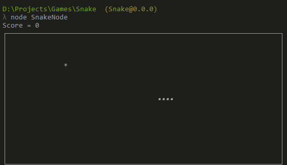

# A simple Snake game written in js, console runner in nodejs

The game is very simple and could probably be written in a single file but
as an exercise I wanted to give ES6 modules + babel a try and additionally 
write some simple tests for each of the modules.

Type checking is done by flow.

The game "engine" is packed into ES6 modules and can be also used in a browser.

To test this visually I wrote a simple nodejs based runner that looks like this:

The runner is only 40 lines of code (mostly keyboard handling and the game loop).
